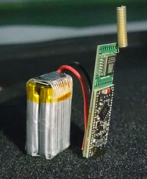
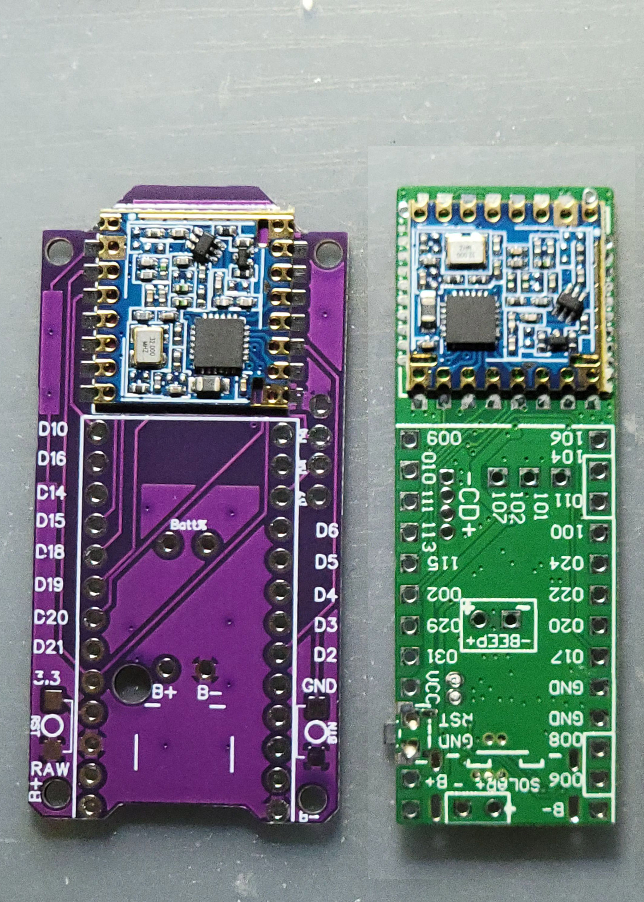
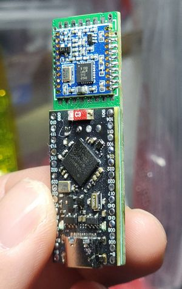
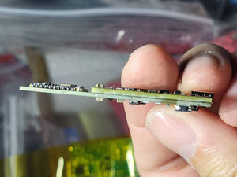
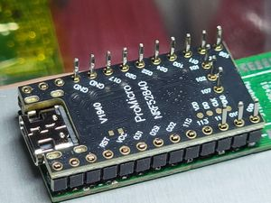
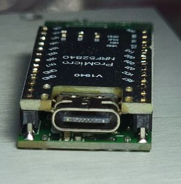
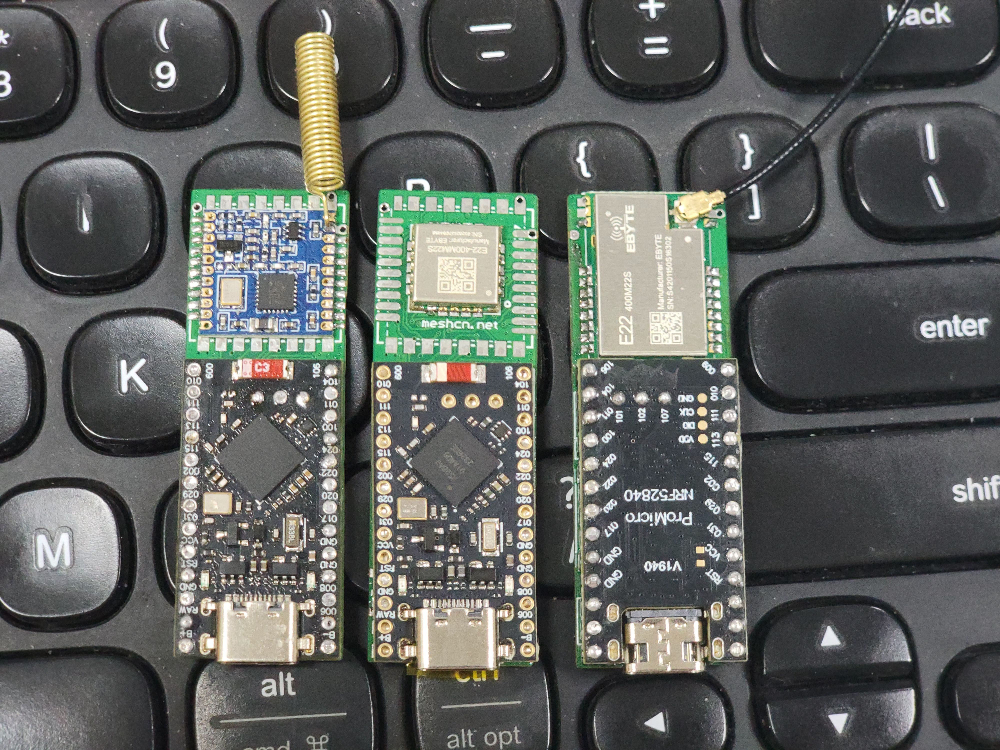
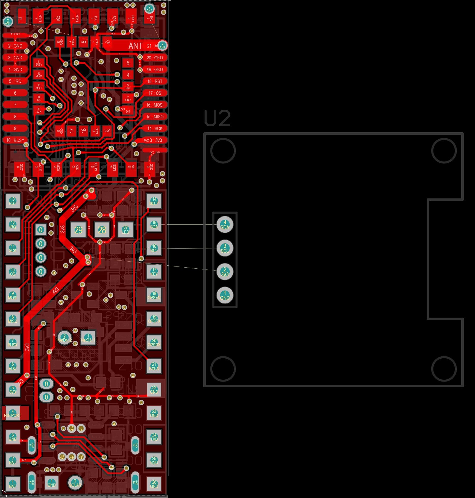
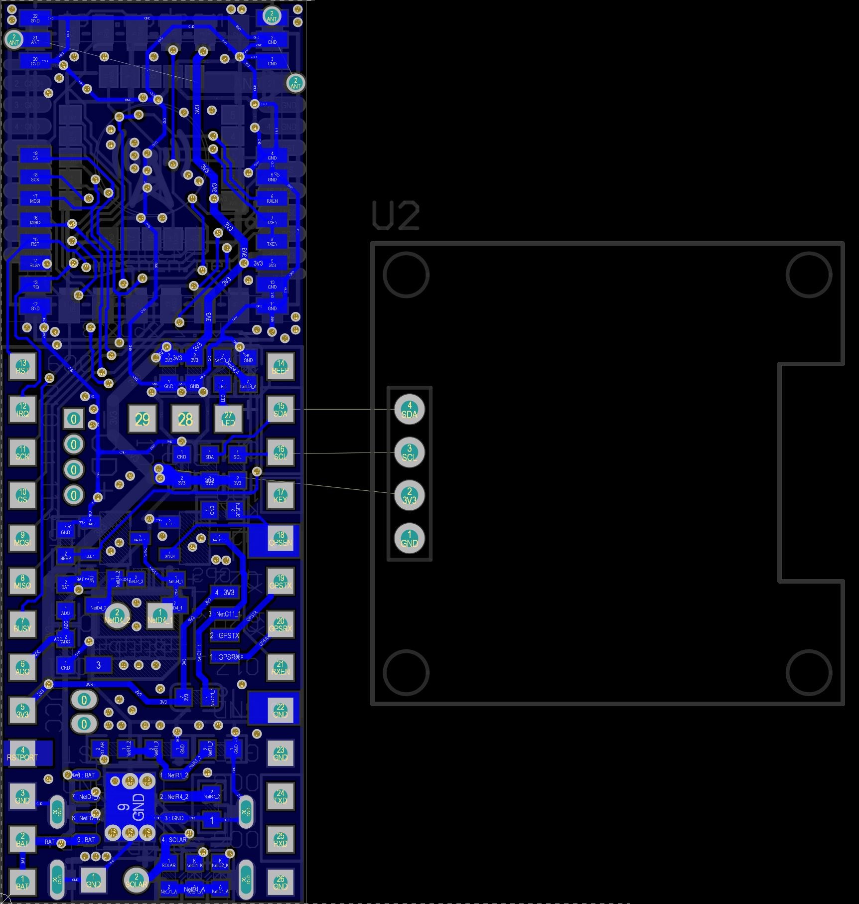
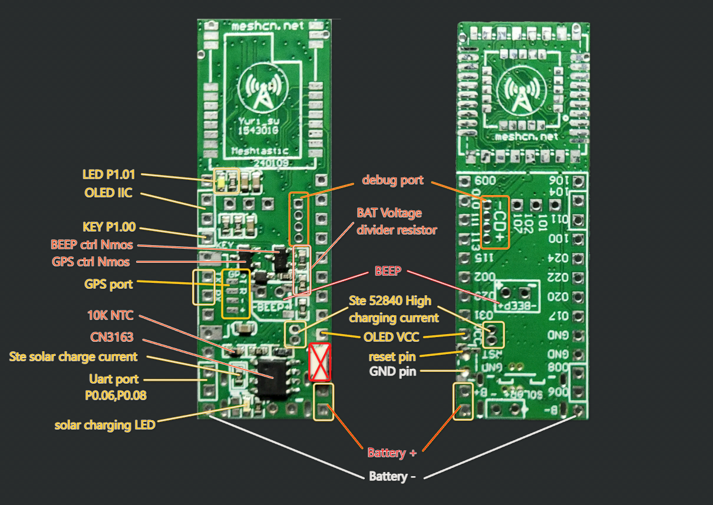

# Meshtastic Low-Cost Controller Open Source Project

> 🌐 [中文版本 / Chinese Version](README_CN.md)



## Project Overview

A low-cost communication controller solution based on the Meshtastic protocol. It integrates solar charging, GPS positioning, and LoRa communication, making it ideal for IoT applications, off-grid communication, and especially solar-powered nodes.

One PCB is compatible with nearly all modules available on the market (great for budget builds).

This project is derived from https://github.com/gargomoma/fakeTec_pcb.

## Comparison with the Original fakeTec



## Feature Modules

### 1. Integrated Solar Charging

- [CN3163 Charge Management IC](https://item.szlcsc.com/582671.html?fromZone=s_s__%2522C559031%2522&spm=sc.gb.xh1.zy.n___sc.hm.hd.ss&t=1739525886502&s=1739525886502&lcsc_vid=FgJaXlFRTwdWBgAAEVBdAlEARwMIVVxUFVENAQdTRAAxVlNVTlRcUlxfR1FbXjtW)

- Temperature protection range: 0–55°C (set via onboard NTC)

- NTC can be removed and replaced with the battery's internal NTC

- Current limiting resistor: 1.2KΩ (1000mA)

- Constant charge voltage: 4.2V

- Input voltage: 4.4–6V

- Dual status indicator outputs: charging and charge-complete


### 2. External Notification Components

**Buzzer**
- Driven via MOSFET (with freewheeling diode) — GPIO **38**
  Must be configured as `38` in both the **Device** page and the **External Notification** page.

**LED**
- External white LED — GPIO **33**
  Configure as `33` in the **External Notification** page only.

**User Button**
- Button KEY — GPIO **32** (default)
  No configuration needed.

**GPS Power Switch**
- GPS enable/disable driven via MOSFET
  Configure in the **Position** page: TX = `20`, RX = `22`, EN = `24`


### 3. GPS Hardware

| Component | Model | Notes |
| :------------ | :---------------------------- | :---------------------------- |
| MCU | ProMicro NRF52840 | [ProMicro NRF52840 Dev Board (no soldering)](https://item.taobao.com/item.htm?id=752027856883&_u=e1fg9to98d5) |
| GPS | ATGM336H-5N71 | [BeiDou/GPS Module + Antenna](https://item.taobao.com/item.htm?id=649721823963&_u=e1fg9to3077) |
| Display | 0.96" SSD1306 OLED | [0.96" OLED IIC Interface](https://item.taobao.com/item.htm?id=537849751788&_u=e1fg9to677b) |


### 4. LoRa Modules

Supported LoRa modules:

| Manufacturer | Model | Notes |
| :------------ | :---------------------------- | :---------------------------- |
| EByte (Chengdu) | E22-400M22S | [Buy Link](https://item.taobao.com/item.htm?id=571626367408&_u=e1fg9toef8a) |
| EByte (Chengdu) | E22-400MM22S | [Buy Link](https://item.taobao.com/item.htm?id=571626367408&_u=e1fg9toef8a) |
| Silicone Power (Shenzhen) | SX1268ZTR4 (433MHz) w/ spring antenna | [Buy Link](https://item.taobao.com/item.htm?id=631724138123&_u=e1fg9to418f) |
| Anxinke (Henan) | SX1268 Ra-01S w/ spring antenna | [Buy Link](https://item.taobao.com/item.htm?id=627657133308&_u=e1fg9toe418) |
| Huitt Automation | RA62 Module SX1262 (433–510MHz) | Untested, should work in theory. [Buy Link](https://item.taobao.com/item.htm?id=687692791680&_u=e1fg9toe418) |

> **Tip:** If you purchase the Anxinke SX1268 Ra-01S and the included antenna is tuned for 433MHz, trimming 3.5 coils will retune it to approximately 480MHz.


### 5. Changelog

**v1.1 Improvements**

- Added MOSFET pull-down resistors to eliminate leakage current

- Reordered GPS connector pinout for direct compatibility with the ATGM336H module

- Solar charging current increased to 1A — note: for batteries under 1Ah, reduce the charge current. A rate of 0.2×–0.5× battery capacity is recommended.

- Added MeshCN logo to PCB silkscreen


### 6. Quick Start

**Soldering Guide**

    
    

**PCB Photo**



**PCB Render**

  

**Schematic**



**Power Consumption Test Data**
https://meshcn.net/Meshtastic-LoRa-RF-Module-Power-Consumption-Test/

**SMD BOM**
https://github.com/Yurisu/meshtastic-faketecyuri/blob/main/fake_yuri_PCB/BOM_faketec52840.xls

**Real-World Communication Range Tests**

*(Coming soon)*

**Bootloader**
https://nicekeyboards.com/docs/nice-nano/getting-started/

Flash command:
```
adafruit-nrfutil dfu serial -p COM26 -pkg nice_nano_bootloader-0.9.2_s140_6.1.1.zip
```

**Meshtastic Firmware Compilation Guide**

*(Coming soon)*

**Verified Hardware Combinations**

*(Coming soon)*

**Known Compatibility Issues**

*(Coming soon)*

**Reserved IO Pin Definitions**

*(Coming soon)*

**Sensor Expansion Options**

*(Coming soon)*

**Community Support**
https://meshcn.net/

**Contributing**

*(Coming soon)*
